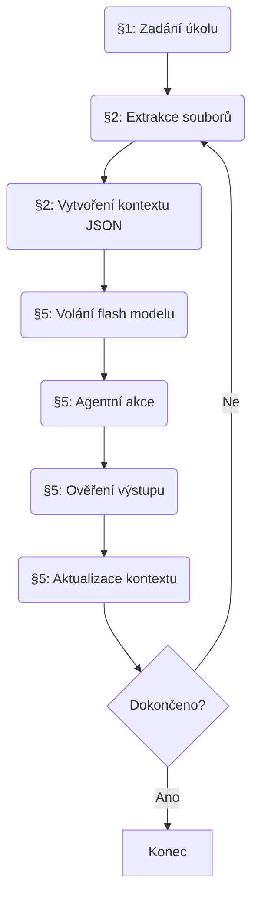

# Výkonné shrnutí

Pro efektivní podporu AI agentů pracujících na konkrétním projektu je klíčové předat jim relevantní, dobře strukturovaný kontext o repozitáři, přičemž je nutné optimalizovat jeho rozsah a podobu. Hlavními typy informací jsou struktura a metadata projektu (souborový strom, architektura, technologie, závislosti), klíčové kódové artefakty (hlavní moduly, funkce, konfigurační soubory, skripty), existující dokumentace (README, AGENTS.md, technické dokumenty) a podpůrné informace (testy, CI/CD, konvence). Tyto informace je třeba vybírat postupně podle relevance k aktuálnímu úkolu a prioritizovat je podle přínosu pro řešení úkolu. Například pro počáteční orientaci v projektu jsou nejdůležitější popis architektury a závislostí (vrstva WHAT【15†L529-L538】), dále konvence a styl (vrstva HOW【15†L529-L538】), a nakonec testy a buildovací příkazy (vrstva FEEDBACK【15†L539-L541】). Kontextový balíček by měl být strukturovaný (např. JSON/YAML obsahující metadata a oddělené sekce), rozdělený do logických bloků („chunků“) a obsahovat pouze informace úzce relevantní pro aktuální úkol – nikoli celé texty (viz *progressive disclosure*【30†L148-L157】【19†L149-L152】). Pro řízení kvality výběru kontextu navrhujeme metriky jako relevance k úkolu (např. vektorové podobnosti), čerstvost (datový nebo verzovací kontext), závislosti na cíli úkolu a tok tokenů (efektivita). Workflow zahrnuje deterministickou extrakci relevantních souborů/funkcí (pomocí pravidel/heuristik založených na názvech či analýze kódu), vytvoření strukturovaného kontextového balíčku, jeho volání flash modelem a následnou validaci a aktualizaci na základě výstupu agenta. Rizika zahrnují potenciál přetížení kontextu nerelevantními informacemi, problémy s licencemi nebo soukromím při vkládání kódu, problémy se synchronizací změn a velikostní limity LLM. Jako mitigace doporučujeme filtrování citlivých údajů, jasné definování pravidel zařazování, průběžné aktualizace a kontrolu kvality kontextu. Souhrnné porovnání typů informací (priorita, velikost) i konkrétní serializační příklady najdete v přiložených tabulkách. Níže shrnujeme podrobný návrh struktury kontextového balíčku, metrik a workflow, podpořený příklady a citacemi relevantních zdrojů.

## 1. Typy informací v repozitáři (a jejich priorita)

Následuje přehled všech kategorií informací v repozitáři, užitečných pro AI agenty, seřazených podle priority (1 = nejvyšší). U každé kategorie je uveden stručný popis a zdůvodnění její užitečnosti.

1. **Architektura a struktura projektu (Stack & Structure)** – přehled technologií, hlavních složek a modulů, klíčových vzájemných závislostí. Poskytuje mapu kódu (velmi důležité pro orientaci ve velkém repozitáři)【15†L529-L538】【30†L64-L73】. Pomáhá agentovi rychle pochopit kontext projektu (např. jedná-li se o webovou aplikaci vs. knihovnu). *Deterministický výběr:* statický přehled adresářové struktury (např. `find . -maxdepth 2` nebo CI/CD konfigurace obsahující cestu)【15†L529-L538】. *Serializace:* shrnutí adresářů a názvů hlavních modulů (např. seznam složek a souborů; JSON polomapa), případně diagram architektury (textový nebo obrázkový). *Velikost:* několik stovek bytů/toků (zkrácený přehled).

2. **Závislosti a konfigurační soubory (Dependencies & Config)** – soubory jako `package.json`, `requirements.txt`, `pom.xml`, `Dockerfile`, `.github/workflows/*.yml` (CI/CD), `.env` apod. Specifikují externí knihovny, buildovací/přepravní nástroje a verze. Agent tak ví, jaká runtime/OS/kompilátory použít【15†L529-L538】【30†L86-L94】. *Výběr:* vzít soubory manifestů a CI skriptů (podle názvů). *Serializace:* uvést klíčové závislosti (např. jména a verze knihoven, základní build-commandy). Lze ignorovat long-tail závislosti nebo je agregovat (např. pouze hlavní frameworky). *Velikost:* pár stovek bytů/toků.

3. **Instrukce a skripty (Build/Test Commands)** – soubory s konkrétními příkazy pro kompilaci, testování, nasazení (např. `Makefile`, `build.sh`, `tests.sh`). Klíčové pro *feedback loop* – agent tak může automaticky ověřovat vlastní výstup (testy a build by měly proběhnout správně)【15†L584-L593】【30†L88-L96】. *Výběr:* hledat soubory obsahující „test“, „build“, „ci“ v názvu, nebo skripty definované v package manifestu. *Serializace:* zkrátit na souhrn (např. *Run tests: `npm test`*, *Build: `mvn package`*). *Velikost:* desítky až stovky bytů.

4. **Dokumentace a README (Docs & READMEs)** – stávající dokumenty (README.md, dokumentace ve složce `docs/`, ADRs, wiki). Poskytují kontext *pro lidi*, který lze těžit agentovi (stresujícím způsobem obsah *co* projekt dělá a *proč*)【30†L64-L73】【30†L120-L128】. V kontextu agenta slouží k pochopení cíle projektu a omezení. *Výběr:* primárně README.md a AGENTS.md v kořeni, dále libovolné soubory v `docs/` související s použitím nebo architekturou. *Serializace:* extrahovat z nich klíčová fakta – popis projektu, obrázek architektury (textová legenda), případné diagramy (možno převést na alternativní text). Rozdělovat do chunků (podle odstavců nebo sekcí) s citací/klíč. slov. *Velikost:* 1000–5000 toků (v závislosti na délce; nutné chunkovat).

5. **AGENTS.md / kontextové soubory (Agent Context Files)** – speciální dokumenty psané přímo pro agenty (AGENTS.md, CLAUDE.md, GEMINI.md apod.). Obsahují **přímé instrukce**: jak spustit projekt, jaké konvence dodržet【11†L83-L91】【30†L86-L96】. Jde v podstatě o „README pro agenty“【30†L120-L128】. *Výběr:* existenci AGENTS.md prověřit (často v kořeni). *Serializace:* jeho plný obsah nebo relevantní části (instalace, příkazy, omezení). Typicky poměrně krátký (řádově stovky toků). *Velikost:* ~200–800 toků.

6. **Konvence a styl (Coding Standards)** – explicitní pravidla formátování a programování (např. CODE_STYLE.md, .editorconfig, linter config). Pomáhají agentovi psát kód v souladu s projektem【15†L529-L538】【30†L120-L128】. *Výběr:* soubory obsahující „style“, „lint“; případně extrahovat ze stylových nastavení (např. `.prettierrc`). *Serializace:* krátký souhrn klíčových pravidel (styly pojmenovávání, komentáře, formátování). *Velikost:* desítky až stovky toků.

7. **Klíčové funkce / moduly (Code Snippets)** – důležité části kódu (např. vstupní body, základní třídy, API rozhraní). Pomáhají agentovi pochopit logiku systému a cíle funkcí. *Výběr:* hledat označení „main“, „app“, „index“, „controller“ apod.; nebo využít statickou analýzu (call graphs, dependency graphs). *Serializace:* ne celý kód (příliš velký), ale např. podpisy funkcí, jména tříd, docstringy či krátké komentáře. Případně generovat shrink-kód (funkce s nejvyšší mírou koncentrace logiky). *Velikost:* podle rozsahu – ideálně stovky toků (ne celé soubory).

8. **Testy a testovací data** – testovací sady a příklady (adresář `tests/`, soubory `*.spec.*`). Umožňují agentovi ověřit svůj výstup (automatizovaná regrese)【15†L539-L541】【15†L584-L593】. *Výběr:* testovací soubory podle konvencí pojmenování. *Serializace:* shrnout, co testují (např. *“Testuji funkci login s chybovými i správnými vstupy”*), nebo extrahovat konkrétní vstup/výstupové páry. *Velikost:* stovky až tisíce toků; pokud je test suite rozsáhlá, prioritizovat klíčové testy.

9. **Historie projektu (commit history, changelog)** – chronologie změn (CHANGELOG.md, výpis posledních commitů). Může přiblížit, proč se projekt vyvíjel určitým způsobem (vrstva WHY)【15†L536-L538】. Nižší priorita v porovnání s aktuálním kódem. *Výběr:* CHANGELOG.md, případně popis PR (nelze automaticky získat z repozitáře bez nástroje). *Serializace:* klíčové poznámky verzí (velké milníky, nové funkce). *Velikost:* desítky toků (klíčové body).

10. **Licence a metadata** – licenční informace, autoři, verze (soubor LICENSE, název a popis projektu). Ujasní legální rámec a dodatečný kontext. *Výběr:* LICENSE, README úvod. *Serializace:* krátký text o licenci a případná upozornění (např. „projekt je GPL-3.0“). *Velikost:* desítky toků.

11. **Další zdroje** – nad rámec standardu: například diagramy (migrace do textu), externí API schémata, vzorová data (služí případně k testům), konfigurace prostředí (terraform, cloud config) apod. *Výběr:* podle kontextu úkolu – pokud má agent nasazovat infrastrukturu, pak terraform; pokud pracuje s daty, pak vzorové soubory. *Serializace:* vybrat relevantní části (např. části schématu API). *Velikost:* variabilní.

Tyto kategorie tvoří kostru kontextového balíčku. Položky vyšší priority (*struktura projektu, závislosti, build/test instrukce*) by měly být agentu vždy předány jako první, pak podle potřeby doplňovány podrobnější informace (*dokumentace, klíčový kód*). Přetížením kontextu se snižuje efektivita agenta, proto je lepší načítat méně a více cílených tokenů【19†L149-L152】【5†L72-L80】.

## 2. Deterministický výběr a serializace informací

Pro každou z výše uvedených kategorií definujeme, jak lze příslušné informace **deterministicky extrahovat** z repozitáře a **zkratit/serializovat** do formátu vhodného pro model. Uvádíme také orientační velikost (v bytech/tokenech).

- **Struktura projektu (WHAT)**
  - *Popis:* přehled složek a hlavních modulů kódu. Dává „mapu“ repozitáře【15†L529-L538】.
  - *Užitečnost:* agentu okamžitě ukáže, jaké části kódu kde hledat (např. odliší frontend/back-end modul). Urychlí průzkum.
  - *Výběr:* spustit příkaz typu `tree -L 2` nebo `ls` v rootu repozitáře (filtrování skrytých souborů). Ve složkách hledat další AGENTS.md, aby navazovaly na odpovídající podsložky【30†L216-L224】.
  - *Serializace:* JSON objekt/pole obsahující seznam top-level složek a klíčových souborů, např. `{"folder": ["src", "tests", "docs"], "files": ["README.md", "AGENTS.md", "Dockerfile"]}`. Alternativně jednoduchý seznam textových řádků s indentací. 
  - *Velikost:* ~100–300 bytů (jednotky stovek toků).

- **Technologický stack a závislosti (Stack)**
  - *Popis:* hlavní programovací jazyky, frameworky a knihovny používané v projektu.
  - *Užitečnost:* agent ví, jaké nástroje má očekávat a používat; může přizpůsobit generaci kódu konkrétní implementaci.
  - *Výběr:* vyhledat manifesty (např. `package.json`, `setup.py`, `pom.xml`, `pyproject.toml`, `Gemfile`), Dockerfile (jazyk obrázku), soubory CI (`.travis.yml`, GitHub Actions). 
  - *Serializace:* extrahovat klíčové položky (např. `"dependencies": {"react": "17.0.0", "express": "4.17.1"}`) nebo napsat seznam (React, Node.js 16, PostgreSQL apod.). Může se vynechat drobná závislost, soustředit se na hlavní. 
  - *Velikost:* 100–500 bytů (pár stovek toků).

- **Konfigurační a build-skripty (HOW, FEEDBACK)**
  - *Popis:* soubory definující, jak projekt sestavit a spustit (Makefile, Dockerfile, CI workflow, skripty `build.sh`, `run_tests.sh`).
  - *Užitečnost:* definují přesné příkazy pro kompilaci, nasazení a testování【15†L584-L593】. Agent může tyto příkazy využít ke kontrole svého výstupu (např. spustit testy) nebo je navrhnout.
  - *Výběr:* vybrat soubory podle názvu (Makefile, Dockerfile, `.yml` ve složce `.github/workflows/`, skripty s `-build` či `-test`). 
  - *Serializace:* sepsat přehled („Build: `docker build .`, Test: `npm test`, Lint: `eslint src/`“). U YAMLů lze zachovat strukturu (JSON/YAML snippet).
  - *Velikost:* řádově 100–300 bytů.

- **README.md a projektová dokumentace**
  - *Popis:* textový popis projektu, často obsahuje instalační pokyny, příklady použití, high-level architekturu.
  - *Užitečnost:* poskytuje širší kontext k tomu, „co projekt dělá“ a „proč“ (vrstva WHY). Někdy obsahuje klíčové diagramy či odkazy.
  - *Výběr:* jednoduše `README.md` z rootu, případně další markdown soubory v `docs/` týkající se architektury nebo návodů. 
  - *Serializace:* extrahovat relevantní části – první úvodní sekce a segmenty o spouštění/provozování. U delších částí postupně chunkovat (např. po odstavcích) s označením kapitoly. Například z README zachytit část „Getting Started“ nebo „Architecture“ a do kontextu vložit JSON: 
    ```json
    {
      "project_description": "Jedná se o webovou aplikaci pro správu objednávek.",
      "architecture": "Frontend (React) komunikuje přes REST API s backendem (Node.js + Express)",
      "installation": "Spuštění: `npm install` a `npm start`",
      "usage_example": "Příklad volání: GET /api/orders"
    }
    ```
  - *Velikost:* 500–3000 tokenů (záleží na délce). Pokud je velmi dlouhé, vybírat klíčové pasáže.

- **AGENTS.md / agent-specifické instrukce**
  - *Popis:* specializovaný dokument zaměřený na agenty (viz [11†L83-L91], [30†L120-L128]). Obsahuje přesné pokyny: příkazy ke kompilaci, pravidla stylu, specifické požadavky.
  - *Užitečnost:* úderný přínos, protože přímo odpovídá otázkám: *Jak projekt provozovat? Jaké konvence dodržovat?*【30†L120-L128】. Jedná se o kontrakt mezi repozitářem a agentem.
  - *Výběr:* pokud soubor existuje v rootu, automaticky jej vybrat. 
  - *Serializace:* vkládá se v plné podobě (je relativně krátký). Případně rozdělen na sekce, pokud je rozsáhlý. Např. JSON:
    ```json
    {
      "install": "`pnpm install`",
      "run_tests": "`pnpm test`",
      "build": "`pnpm build`",
      "style": "TypeScript strict, single quotes, no semicolons"
    }
    ```
  - *Velikost:* typicky 100–500 tokenů.

- **Pravidla stylu a konvence (HOW)**
  - *Popis:* informace o formátování a architektuře kódu (např. CODE_STYLE.md, `.prettierrc`, `tslint.json`). 
  - *Užitečnost:* minimalizuje nedorozumění – agent generuje kód ve správném stylu【15†L529-L538】.
  - *Výběr:* soubory s klíčovými slovy „style“, „lint“; extrahovat příslušné řádky (např. oddělovače, formátování).
  - *Serializace:* stručné pravidlo: *„Použij 2-mezerový indent, bez trailing semicolons. Tests: soubory *.spec.ts“* nebo přímo vybraná konfigurace ve strojovém formátu JSON. 
  - *Velikost:* desítky tokenů.

- **Klíčové části kódu (function signatures, cores)**
  - *Popis:* vybrané funkce/třídy, které vykonávají centrální logiku projektu.
  - *Užitečnost:* agent obdrží kontext, co která část dělá. Např. zná-li podpis funkce `calculateInvoice(total, items)`, může lépe navrhovat její opravy.
  - *Výběr:* lze analyzovat AST (např. tree-sitter) pro nalezení hlavních exportů, nebo detekovat názvy „Service“, „Controller“, „Manager“ atd. V praxi stačí vybrat základní řídící moduly (`App.java`, `main.py` a podobně).
  - *Serializace:* zkopírovat hlavičky funkcí, jména a případně výcucy komentářů (viz [15†L552-L560]). Místo plného těla kódu raději uvést popis.
  - *Velikost:* proměnlivá; zaměřit se na stovky tokenů.

- **Testy a testovací scénáře**
  - *Popis:* soubory s testy (nazvané například `*Spec.java`, `test_*.py`), případně soubory s testovacími daty.
  - *Užitečnost:* agent může validovat změny spuštěním testů nebo inspirovat se testovacími případy. Fyzicky skripty i data odhalují očekávané chování systému【15†L539-L541】.
  - *Výběr:* soubory ve složce `test` nebo s příponou naznačující test. 
  - *Serializace:* například uvést, jaké hlavní případy testují (hraní a negativní), nebo vložit klíčové řádky assert. JSON třeba:
    ```json
    {
      "tests": [
        {"name": "UserAuthTest", "description": "Testuje neplatné heslo"},
        {"name": "OrderCreationTest", "description": "Test správného vytvoření objednávky"}
      ]
    }
    ```
  - *Velikost:* stovky až tisíce tokenů (v závislosti na počtu testů), takže je doporučeno selektivní shrnutí.

- **Historie změn a motivace (WHY)**
  - *Popis:* soubory jako CHANGELOG.md, dokumenty architektonických rozhodnutí (ADR), komentáře k merge requestům.
  - *Užitečnost:* odpovídá na otázku *proč* je projekt tak navržen. Může objasnit neintuitivní rozhodnutí (vrstva WHY【15†L536-L538】). Nedostatek tohoto kontextu vede často k chybám agenta.
  - *Výběr:* CHANGELOG.md, ADRs ve složce `/docs/arch/`, případně poznámky ke commitům (vyžaduje git log – tazatel by to musel předat).
  - *Serializace:* úryvky popisující důvody změn nebo klíčová rozhodnutí. Např. *„Version 2.0: přechod z SQL na NoSQL kvůli škálovatelnosti“*.
  - *Velikost:* desítky tokenů (jen shrnutí hlavních bodů).

- **Licence a projektové metadata**
  - *Popis:* informace o licenci (např. MIT, Apache) a základní metadata (název, autor, verze).
  - *Užitečnost:* definuje právní rámec a autorské vlastnictví. Může ovlivnit generování komerčně citlivého kódu.
  - *Výběr:* soubor LICENSE, prvky v package manifestu (`name`, `author`, `version`, `description`).
  - *Serializace:* například JSON s položkami `{license: "GPL-3.0", version: "1.4.2"}`.
  - *Velikost:* desítky tokenů.

Každý z výše uvedených typů informací by měl být do kontextu zahrnut **cíleně** – například jen pokud je pro aktuální úkol relevantní. Komplexní repozitáře mohou používat hierarchickou strukturu (více *AGENTS.md* na různých úrovních【30†L216-L224】), takže agent by měl načítat jen sekce vztahující se k příslušné části kódu. Celkově **minimalizujeme** počet tokenů; každý dotaz na LLM by měl dostat jen ty sekce, které mají smysl pro daný úkol【19†L149-L152】【30†L148-L157】.

## 3. Metriky a kritéria pro výběr a priorizaci

Pro řízení, která data a části repozitáře opravdu vložit do kontextu, navrhujeme následující metriky a kritéria:

- **Relevance (relevance k úkolu):** měřit podobnost obsahu (kódových fragmentů, dokumentů) s popisem úkolu. Např. vektorové srovnání klíčových slov úkolu se jmény funkcí/souborů. Vysoká relevance získá vyšší prioritu. (Viz měření relevance v kontextových systémech【22†L373-L381】.)
- **Frekvence změn (čerstvost):** soubory upravené nedávno mohou obsahovat nové požadavky nebo opravovat chyby související s úkolem. Starší soubory mohou být méně relevantní. Metrika může vycházet z počtu commitů v posledním období.
- **Závislost na cíli:** jak silně součást repozitáře závisí na tématu úkolu. Např. pokud je úkol “upravit API pro objednávky”, soubor `OrderController.java` má vyšší skóre než úvodní obrazová příloha.
- **Bezpečnostní riziko:** části kódu obsahující citlivá data (klíče, hesla) by měly mít nižší prioritu nebo být redakčně maskovány. Licence/restrikce kódu mohou naopak vyřadit některé části z automatického využití.
- **Tokenová efektivita:** metrika počtu tokenů vložených do kontextu. Nižší je lepší, aby se nepřekročil limit. Měří se poměr přínosu k počtu tokenů. (Relevantní metrika *tokenové úspory*【22†L378-L382】.)
- **Průkaznost (provability):** například počet dokumentovaných příkladů nebo testů pro danou informaci (více zpětné vazby => důvěryhodnost). Konkrétně v RAG systémech se sleduje recall/precision k gold kontextu【21†L126-L135】, ale v naší praxi jde o ruční eval.
- **Latence při získání:** některé informace (např. generování vizuálního diagramu) mohou být náročné na čas. Pokud je potřeba rychlého rezultátu, upřednostňovat rychle extrahovatelné zdroje.

Tyto metriky lze sledovat a vážit (např. jako bodový systém či normalizovaný skóre). Důležité je dynamicky *testovat* různé konfigurace kontextu (A/B testování) a analyzovat úspěšnost agenta – viz metriky kvality【22†L373-L381】 jako zvýšení počtu úspěšně vyřešených úkolů, snížení chybovosti nebo menší latence.

## 4. Struktura kontextového balíčku a formát pro model

Navrhujeme kontextový balíček reprezentovat jako **strukturovaný artefakt** (např. JSON či YAML), rozdělený na části („layers“) a indexy. Obvyklá vrstva může obsahovat: 
- **Metadata:** obecné údaje o repozitáři (jméno, verze, licence, jazyk), datu sestavení a zdroji kontextu (např. čas získání, nástroje použité k extrakci). 
- **Repository Map:** stručný popis struktury (výše zmíněná „mapa“ adresářů), aby agent věděl, která podsložka má jaké informace.
- **Klíčové soubory:** oddělené sekce jako *"Dependencies"*, *"CI/CD"*, *"Instructions"* obsahující text přímo z manifestů nebo skriptů.
- **Dokumentační vrstvy:** jako *"AgentsDoc"*, *"UserDoc"* – například obsah AGENTS.md a README.md. Také *"Architecture"* a *"DecisionLog"* pro WHY-část.
- **Kódové vrstvy:** *"SourceSnippets"* obsahující shrnutí funkcí/tříd a *"Tests"* shrnutí testů.
- **Indexy a klíčová slova:** vynucená škrtací pravidla pro rychlé hledání – například seznam klíčových entit (př. hlavní názvy tříd) a lokace v kontextu (odkazy).

Příklad části JSON balíčku (pro ilustraci, *nemusí* pokrývat vše):
```json
{
  "metadata": {
    "name": "OrderManagementSystem",
    "version": "2.1.0",
    "language": "Python",
    "last_updated": "2026-05-15",
    "license": "Apache-2.0"
  },
  "structure": {
    "folders": ["src", "tests", "docs"],
    "files": ["README.md", "AGENTS.md", "requirements.txt"]
  },
  "agents_instructions": {
    "install": "pip install -r requirements.txt",
    "run_tests": "pytest tests/",
    "style": "PEP8, black formatting"
  },
  "dependencies": ["Flask", "SQLAlchemy", "Redis"],
  "architecture": "Monolitická webová aplikace s REST API",
  "source_snippets": {
    "UserService": "class UserService: ...",
    "OrderController": "class OrderController: ..."
  },
  "test_summary": "Testování tvorby objednávky a autentizace uživatelů"
}
```

**Formát:** JSON je výhodný pro strojové zpracování (validator, rychlé parsování) a umožňuje přidání schématu. YAML je lidsky čitelnější (méně zápisů) ale pro LLM může být tokenově dražší (více syntaktických znaků). Pro naše účely navrhujeme JSON (nebo Protobuf podle požadavků) jako hlavní formát. V JSONu můžeme definovat schéma (např. Protobuf definice) pro různé vrstvy kontextu. 

**Chunking pravidla:** Protože některé elementy (např. dokumentace, kód) mohou být rozsáhlé, je třeba je rozdělit do menších bloků:
- **Chunk podle semantiky:** např. odstavce v dokumentech, nebo jednotlivé funkce ve zdrojáku (oddělené znaky, komentáře).
- **Tokenový limit:** definovat maximální délku chunku (např. 500–1000 tokenů), pak delší segmenty přerušit. 
- **Sekvenční chunking:** pro dlouhý soubor vytvořit několik chunků označených částmi (např. `README_part1`, `README_part2`).
- **Index + obsah:** ke každému chunku ukládat metadata (název/umístění) pro rychlé dohledání.
  
Konkrétní serializační příklady deserializovaných souborů jsou v tabulce níže.

## 5. Navrhovaný workflow a sekvenční diagram

Navrhujeme následující postup (workflow) pro generování a udržování kontextového balíčku pro konkrétní úkol:

```mermaid
flowchart TB
    A[Zadání úkolu od uživatele] --> B[Identifikace relevantních složek/souborů]
    B --> C[Vytvoření/aktualizace kontextového balíčku]
    C --> D[Volání flash modelu (kontext → LLM)]
    D --> E[Agent provede akce (např. kódování)]
    E --> F[Verifikace výstupu (testy, ruční kontrola)]
    F --> G[Úprava kontextu na základě nových poznatků]
    G --> H{Další úkol?}
    H -- ano --> B
    H -- ne --> I[Konec cyklu]
```

- **Identifikace relevantních souborů:** Podle klíčových slov úkolu se deterministicky vyhledají soubory/funkce v repozitáři (např. grep po názvech funkcí, regex na zadání úkolu). Může se použít předvytrénovaná „scratchpad“ analýza (AST parser) pro vyhledání souvisejících modulů.
- **Vytvoření/aktualizace kontextu:** Z vybraných souborů se extrahují relevantní informace podle schématu (body 2–3). Výstup zflash modelu (či funkce) slouží k sestavení nebo doplnění JSON kontextu.
- **Volání flash modelu:** Do LLM (s velkou pamětí – „flash“) se posílá konkrétní prompt obsahující kontextový balíček a instrukci (např. „Napiš nový modul, který…“).
- **Verifikace a aktualizace:** Agentův výstup se ověří testy z repozitáře. Pokud AI chybovala, dojde k aktualizaci kontextu (např. doplnění chybějícího pravidla nebo příkladu do AGENTS.md) a cyklus se opakuje.

*Toto workflow zajišťuje deterministický a repeti­tivní postup:* všechny kroky jsou definovány skripty nebo agentními moduly, nikoliv ad-hoc (preventivní proti „zapomenutí“ klíčových souborů). Diagram výše ilustruje sekvenci.  

### Tabulka workflow kroků

| Krok                               | Odpovědnost        | Latence             |
|------------------------------------|--------------------|---------------------|
| Identifikace souborů/funkcí        | Analyzátor/Agent   | ~0.1–1 s (grep/analýza) |
| Extrakce a serializace kontextu    | Sběrač kontextu    | ~0.5–2 s (IO, parsing)  |
| Volání flash modelu (inference)    | Model (LLM)        | ~100–500 ms/tok       |
| Zpracování odpovědi a ověření      | Agent/Human review | ~0.1–1 s (spuštění testů) |
| Aktualizace kontextového balíčku   | Agent/DevOps       | ~0.2–1 s (editace JSON) |
| **Celkem (jednotlivý cyklus)**     |                    | **~1–5 s** (plus latency modelu) |

## 6. Rizika a omezení

Při práci s kontextem z repozitáře je třeba brát v úvahu následující rizika:

- **Soukromí a citlivost:** Kódová báze může obsahovat citlivé informace (API klíče, osobní data). Kontext je často předáván externím modelům. *Mitigace:* filtrovat či redigovat citlivé hodnoty (zaclonění) před serializací, případně omezit přístup k modelům na interní instance.
- **Licence a právní omezení:** Kopírování kódu do kontextu může porušit licenční podmínky (např. GPL kód). *Mitigace:* ověřit licenci, poskytnout jen smíšené zpřístupněné části (dokumentace nebo vlastní kód) a udat zdroje (metadata).
- **Velikost kontextu:** I flash modely mají limit. Příliš mnoho nepotřebných tokenů vede ke „context rot“【5†L72-L80】 a finančním nákladům. *Mitigace:* držet se minimalismu (viz progressive disclosure【19†L149-L152】), chunkovat a upřednostňovat malé a relevantní bloky.
- **Konzistence a aktuálnost:** Repozitář se může měnit (commity, nové featury) rychleji než se kontext aktualizuje. *Mitigace:* automatizovat proces aktualizace (po každém commitu regenerovat relevantní část kontextu) a verzovat context balíček. Pravidelně kontrolovat konzistenci (např. kontrolní součty).
- **Chyby ve výběru kontextu:** Příliš úzký kontext může postrádat klíčové informace, příliš široký může zmást model. *Mitigace:* empiricky kalibrovat (A/B testing různých kontextových sad), zavést testy pokrývající známé scenáře agenta (viz metriky úspěšnosti).
- **Fragmentace a správa kontextu:** V monorepách či multi-rep projektech může být řada lokálních AGENTS.md. *Mitigace:* definovat jasná pravidla (např. nesting【30†L216-L224】) a nástroje pro agregaci (kontext balíček generovat modulárně pro každý sub-projekt).

## 7. Příklady serializace a porovnání typů položek

### Tabulka typů informací

| Typ informace         | Charakteristika                      | Priorita | Odhad velikosti | Selektor (heuristika)       |
|-----------------------|--------------------------------------|----------|-----------------|-----------------------------|
| Architektura projektu | popis modulu/složek, technologie    | 1        | ~200 toků       | `tree`/adresářový listing   |
| Závislosti (Stack)    | hlavní knihovny, runtime            | 2        | ~150 toků       | `package.json`/CI soubory   |
| Instrukce (build/test) | příkazy, skripty                    | 3        | ~100 toků       | Makefile, `*.sh`, CI config |
| Dokumentace (README)  | popis + příklady použití            | 4        | 500–3000 toků   | README.md, /docs/           |
| AGENTS.md             | instrukce pro agenta                | 5        | 100–500 toků    | AGENTS.md                   |
| Styly/Konvence        | formátování, guidelines             | 6        | ~50 toků        | CODE_STYLE.md, .config      |
| Klíčový kód (rozhraní) | definice tříd/funkcí                | 7        | 100–400 toků    | AST analýza, grep           |
| Testy                 | test script, test cases             | 8        | 200–1000 toků   | adresář *tests*            |
| Historie/CHANGELOG    | časové poznámky, verze             | 9        | ~50 toků        | CHANGELOG.md               |
| Licence/metadata      | právní info, autoři                | 10       | ~20 toků        | LICENSE, manifest         |

### Příklady serializace (JSON)

Ukázka 5 typických souborů a jejich serializace do JSON:

| Soubor            | Obsah                                   | JSON serializace                                |
|-------------------|-----------------------------------------|--------------------------------------------------|
| `package.json`    | seznam závislostí projektu              | `{ "dependencies": ["react", "lodash", "express"] }` |
| `AGENTS.md`       | instrukce pro agenta                    | `{ "install": "npm install", "test": "npm test", "style": "ESLint rules" }` |
| `README.md`       | popis projektu                         | `{ "project": "Webová aplikace pro ...", "start": "npm start", "usage": "GET /api/items" }` |
| `Dockerfile`      | build instrukce pro Docker image        | `{ "base_image": "python:3.9", "build_cmd": "COPY . /app && pip install", "run_cmd": "CMD [\"python\",\"app.py\"]" }` |
| `OrderController.java` | definice třídy pro objednávky      | `{ "class": "OrderController", "methods": ["createOrder()", "cancelOrder()"], "description": "Obsluhuje REST API objednávek" }` |

(*Pozn.: Jednotlivé položky nad JSONem jsou zkráceny příklady – v praxi by byly čteny/parsovány a zapsány automatizovaně.*)

### Mermaid diagram workflow



## 8. Metriky pro evaluaci výsledků

Pro měření kvality a přínosu vytvořeného kontextu doporučujeme sledovat tyto metriky:
- **Úspěšnost úkolu:** míra úspěšného dokončení úloh agentem při daném kontextu (např. pass@k, úspěšné odevzdané PR)【22†L384-L388】.
- **Přesnost agentova výstupu:** kolik navržených změn odpovídá požadavkům (např. procento kódu bez chyb).
- **Tokenová efektivita:** průměrný počet tokenů kontextu potřebných pro jednu úspěšnou odpověď【22†L378-L382】.
- **Latence:** čas potřebný pro sestavení a zpracování kontextu + inference modelu. Sledujeme dobu od zadání úkolu do návratu výstupu.
- **Využití kontextu:** recall/precision relevantních částí (či procento relevantních tokenů použito)【21†L126-L135】.
- **Uživatelská spokojenost/učitelova zpětná vazba:** subjektivní hodnocení kvality a užitečnosti agentovy pomoci.

Každou metriku lze reportovat před a po optimalizaci kontextu, nebo pro různé varianty kontextového balíčku (baseline bez kontextu vs. s upraveným kontextem).

**Zdroje:** Výše uvedené strategie vycházejí z oficiálních doporučení a výzkumných prací o kontextu pro LLM agenty【11†L83-L91】【15†L529-L538】【19†L149-L152】【5†L72-L80】【22†L373-L381】. Ty potvrzují zásady minimalismu a strukturovanosti při práci s LLM (např. *minimalní potřebný kontext*【19†L149-L152】, *context jako omezený zdroj*【5†L72-L80】, *hierarchické a vrstvené kontextové soubory*【15†L529-L538】【30†L148-L157】).